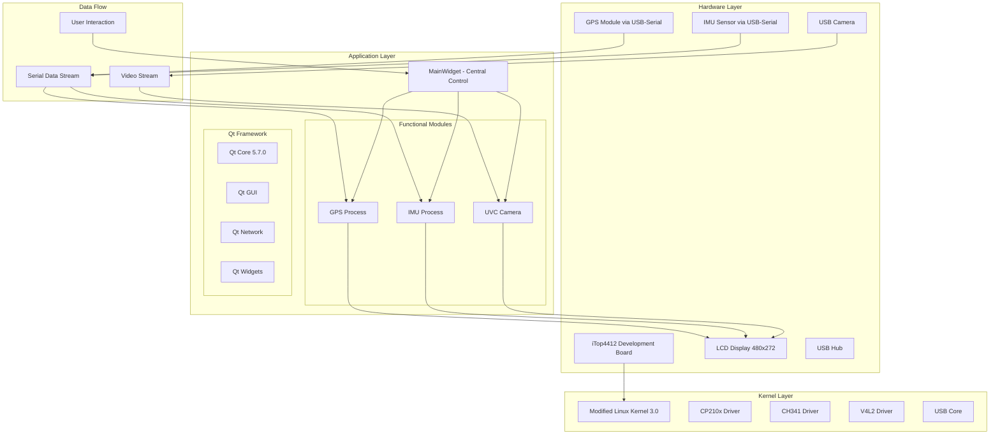

# Embedded Linux Camera System
# 嵌入式Linux相机系统

<div align="center">


</div>

## Language / 语言

- [English](#english-documentation)
- [中文](#中文文档)

---

## English Documentation

### 🚗 Project Overview

`Linux_Camera` is a Qt-based embedded Linux camera system designed for embedded Linux platforms. The system integrates camera feed processing, GPS positioning, and IMU sensor monitoring capabilities, providing a comprehensive solution for embedded camera applications.

### 🎯 Key Features

- **USB Camera Integration** - Real-time video capture with YUV to RGB conversion
- **GPS Positioning** - NMEA protocol parsing with coordinate and speed display
- **IMU Monitoring** - Real-time accelerometer, gyroscope, and angle data visualization
- **Modular Architecture** - Clean separation of concerns with dedicated modules

### 🏗️ System Architecture



### 🛠️ Development Environment

| Component | Version/Model |
|-----------|---------------|
| **Cross-compilation** | Ubuntu 16.04 |
| **Qt Framework** | 5.7.0 |
| **Filesystem** | QTE5.7 Image |
| **Linux Kernel** | Modified iTop4412_Kernel_3.0 |
| **Target Board** | iTop4412 Development Board |
| **Display** | 480×272 LCD |

### 📦 Hardware Components

| Module | Model | Interface |
|--------|-------|-----------|
| **IMU Sensor** | YaBo Intelligence | USB-Serial (CP210x/CH341) |
| **GPS Module** | YaBo Intelligence | USB-Serial (CP210x/CH341) |
| **USB Camera** | HikVision | USB 2.0 |
| **USB Hub** | UGREEN | USB 2.0 |


### 📁 Project Structure

```
Linux_Camera/
├── 📁 Root Directory
│   ├── main.cpp                    # Application entry point
│   ├── mainwidget.cpp/.h          # Main interface
│   └── Linux_Camera.pro          # Qt project configuration
│
├── 📡 GPSProcess/                  # GPS data processing
│   ├── GPSProcess.cpp/.h          # NMEA protocol parsing
│   └── Serial communication with GPS module
│
├── 📱 IMUProcess/                  # IMU sensor processing
│   ├── IMUProcess.cpp/.h          # Accelerometer, gyroscope data
│   └── Motion detection and alerts
│
├── 📹 UVC/                        # USB camera module
│   ├── processImage.cpp/.h       # Image processing
│   ├── videodevice.cpp/.h         # V4L2 camera interface
│   └── YUV to RGB conversion
│
└── 🔧 bin/                        # Compiled executables
    └── Linux_Camera
```

### 🔧 Module Descriptions

#### 🏠 MainWidget (Central Control)
- **Purpose**: Main interface with functional modules
- **Features**: 
  - Module navigation and window management
  - Resource management with automatic cleanup

#### 📡 GPS Processing Module
- **Purpose**: Real-time GPS data acquisition and parsing
- **Protocol**: NMEA 0183 ($GNGGA, $GNVTG sentences)
- **Features**:
  - Coordinate parsing (latitude/longitude)
  - Speed calculation (knots/km/h)
  - Satellite count and signal quality
  - Asynchronous serial communication

#### 📱 IMU Processing Module
- **Purpose**: Inertial measurement and motion detection
- **Features**:
  - 3-axis accelerometer data
  - 3-axis gyroscope data
  - Calculated angle information
  - Collision detection with buzzer alerts

#### 📹 Camera Module
- **Purpose**: USB camera video stream processing
- **Technology**: Video4Linux2 (V4L2) API
- **Features**:
  - Real-time video capture
  - YUV422 to RGB24 color space conversion
  - Frame rate optimization
  - Error handling and device management

### 🚀 Installation and Setup

#### 1. Kernel Configuration
Navigate to the iTop4412_Kernel_3.0 directory and configure the kernel:

```bash
make menuconfig
```

Enable the following drivers:

**CP210x USB-to-Serial Driver:**
```
Device Drivers --->
    [*] USB support --->
        USB Serial Converter support ---> 
            <*> USB CP210x family of UART Bridge Controllers
```

**CH341 USB-to-Serial Driver:**
```
Device Drivers --->
    [*] USB support ---> 
        USB Serial Converter support ---> 
            <*> USB CH341 support
```

Compile the kernel:
```bash
make zImage
```

Flash the kernel using fastboot:
```bash
fastboot flash kernel zImage
```

#### 2. Cross-compilation
In Ubuntu 16.04 environment:

```bash
# Navigate to project directory
cd Linux_Camera/

# Generate Makefile
qmake

# Compile the project
make

# The executable will be generated in bin/
```

#### 3. Deployment

1. **Prepare the target board:**
   - Flash the modified kernel and QTE5.7 filesystem
   - Connect debug serial port to PC
   - Power on the development board

2. **Network setup:**
   - Configure Ethernet connection between PC and board
   - Set PC IP: `192.168.137.1`
   - Set board IP: `192.168.137.2`
   - Set board gateway: `192.168.137.1`

3. **Hardware connections:**
   - Connect USB hub to iTop4412
   - Connect GPS module, IMU sensor, USB camera, and mouse to hub
   - Ensure proper device enumeration (`/dev/ttyUSB0`, `/dev/ttyUSB1`)

4. **File transfer and execution:**
   ```bash
   # Copy project to USB drive, then to board
   # On the target board:
   chmod +x Linux_Camera
   ./Linux_Camera
   ```

### 🧪 Testing and Validation

| Module | Test Criteria |
|--------|---------------|
| **GPS** | Coordinate accuracy, speed calculation |
| **Camera** | Real-time video feed, color conversion |
| **IMU** | Motion detection, collision alerts |

### ⚙️ Configuration Notes

- **Device mapping**: IMU → `/dev/ttyUSB0`, GPS → `/dev/ttyUSB1`
- **Baud rates**: GPS (9600), IMU (115200)
- **Display resolution**: 480×272 pixels
- **Network proxy**: Configured for HTTP proxy at `192.168.137.1:7890`

### 🎬 System Demonstration

The system provides real-world functionality including camera feed processing, GPS positioning, and IMU sensor monitoring.

### 🔧 Troubleshooting

**Common Issues:**

1. **Serial device not found**
   - Check USB device enumeration: `lsusb`
   - Verify driver loading: `lsmod | grep usbserial`

2. **Camera initialization failed**
   - Check V4L2 device: `ls /dev/video*`
   - Verify camera compatibility: `v4l2-ctl --list-devices`

3. **Network connectivity issues**
   - Test basic connectivity: `ping 8.8.8.8`
   - Check proxy configuration in main.cpp

---

## 中文文档

### 🚗 项目概述

`Linux_Camera` 是一个嵌入式 Linux 相机系统，专为嵌入式 Linux 平台设计。系统集成了相机图像处理、GPS 定位和 IMU 传感器监控功能，为嵌入式相机应用提供了全面的解决方案。

### 🎯 核心功能

- **USB 相机集成** - 实时视频捕获，YUV 到 RGB 转换
- **GPS 定位** - NMEA 协议解析，显示坐标和速度信息
- **IMU 监控** - 实时加速度计、陀螺仪和角度数据可视化
- **模块化架构** - 清晰的关注点分离，专用功能模块

### 🏗️ 系统架构图

上方的系统架构图展示了整个系统的层次结构：

**硬件层**：包括 iTop4412 开发板、GPS 模块、IMU 传感器、USB 摄像头等硬件组件

**内核层**：经过修改的 Linux 3.0 内核，包含 CP210x、CH341 驱动程序和 V4L2 驱动

**应用层**：基于 Qt 5.7.0 框架的应用程序，包含主控制器和各功能模块

### 🛠️ 开发环境

| 组件 | 版本/型号 |
|------|-----------|
| **交叉编译环境** | Ubuntu 16.04 |
| **Qt 框架** | 5.7.0 |
| **文件系统** | 讯为 QTE5.7 镜像 |
| **Linux 内核** | 修改版 iTop4412_Kernel_3.0 |
| **目标板** | iTop4412 开发板 |
| **显示屏** | 480×272 LCD |

### 📦 硬件组件

| 模块 | 型号 | 接口 |
|------|------|------|
| **IMU 传感器** | 亚博智能 | USB-串口 (CP210x/CH341) |
| **GPS 模块** | 亚博智能 | USB-串口 (CP210x/CH341) |
| **USB 摄像头** | 海康威视 | USB 2.0 |
| **USB 扩展坞** | 绿联 | USB 2.0 |

### 📁 项目结构

```
Linux_Camera/
├── 📁 根目录
│   ├── main.cpp                    # 应用程序入口
│   ├── mainwidget.cpp/.h          # 主界面
│   └── Linux_Camera.pro          # Qt 项目配置文件
│
├── 📡 GPSProcess/                  # GPS 数据处理
│   ├── GPSProcess.cpp/.h          # NMEA 协议解析
│   └── 与 GPS 模块的串口通信
│
├── 📱 IMUProcess/                  # IMU 传感器处理
│   ├── IMUProcess.cpp/.h          # 加速度计、陀螺仪数据
│   └── 运动检测和报警
│
├── 📹 UVC/                        # USB 摄像头模块
│   ├── processImage.cpp/.h       # 图像处理
│   ├── videodevice.cpp/.h         # V4L2 摄像头接口
│   └── YUV 到 RGB 转换
│
└── 🔧 bin/                        # 编译后的可执行文件
    └── Linux_Camera
```

### 🔧 模块详细说明

#### 🏠 MainWidget（中央控制器）
- **功能**：主界面，包含功能模块
- **特性**：
  - 模块导航和窗口管理
  - 自动清理的资源管理

#### 📡 GPS 处理模块
- **功能**：实时 GPS 数据采集和解析
- **协议**：NMEA 0183（$GNGGA、$GNVTG 语句）
- **特性**：
  - 坐标解析（经度/纬度）
  - 速度计算（节/公里/小时）
  - 卫星数量和信号质量
  - 异步串口通信

#### 📱 IMU 处理模块
- **功能**：惯性测量和运动检测
- **特性**：
  - 3 轴加速度计数据
  - 3 轴陀螺仪数据
  - 计算角度信息
  - 碰撞检测与蜂鸣器报警

#### 📹 摄像头模块
- **功能**：USB 摄像头视频流处理
- **技术**：Video4Linux2 (V4L2) API
- **特性**：
  - 实时视频捕获
  - YUV422 到 RGB24 色彩空间转换
  - 帧率优化
  - 错误处理和设备管理

### 🚀 安装和配置

#### 1. 内核配置
进入 iTop4412_Kernel_3.0 目录并配置内核：

```bash
make menuconfig
```

启用以下驱动程序：

**CP210x USB 转串口驱动：**
```
Device Drivers --->
    [*] USB support --->
        USB Serial Converter support ---> 
            <*> USB CP210x family of UART Bridge Controllers
```

**CH341 USB 转串口驱动：**
```
Device Drivers --->
    [*] USB support ---> 
        USB Serial Converter support ---> 
            <*> USB CH341 support
```

编译内核：
```bash
make zImage
```

使用 fastboot 烧录内核：
```bash
fastboot flash kernel zImage
```

#### 2. 交叉编译
在 Ubuntu 16.04 环境中：

```bash
# 进入项目目录
cd Linux_Camera/

# 生成 Makefile
qmake

# 编译项目
make

# 可执行文件将在 bin/ 目录中生成
```

#### 3. 部署

1. **准备目标板：**
   - 烧录修改后的内核和 QTE5.7 文件系统
   - 连接调试串口到 PC
   - 开启开发板电源

2. **网络设置：**
   - 配置 PC 和开发板之间的以太网连接
   - 设置 PC IP：`192.168.137.1`
   - 设置开发板 IP：`192.168.137.2`
   - 设置开发板网关：`192.168.137.1`

3. **硬件连接：**
   - 将 USB 扩展坞连接到 iTop4412
   - 将 GPS 模块、IMU 传感器、USB 摄像头和鼠标连接到扩展坞
   - 确保设备正确枚举（`/dev/ttyUSB0`、`/dev/ttyUSB1`）

4. **文件传输和执行：**
   ```bash
   # 将项目复制到 U 盘，然后复制到开发板
   # 在目标板上：
   chmod +x Linux_Camera
   ./Linux_Camera
   ```

### 🧪 测试和验证

| 模块 | 测试标准 |
|------|----------|
| **GPS** | 坐标精度、速度计算 |
| **摄像头** | 实时视频流、颜色转换 |
| **IMU** | 运动检测、碰撞报警 |

### ⚙️ 配置说明

- **设备映射**：IMU → `/dev/ttyUSB0`，GPS → `/dev/ttyUSB1`
- **波特率**：GPS (9600)，IMU (115200)
- **显示分辨率**：480×272 像素
- **网络代理**：配置为 HTTP 代理 `192.168.137.1:7890`

### 🎬 系统演示效果

系统提供了相机图像处理、GPS 定位和 IMU 传感器监控的实际功能演示。

### 🔧 故障排除

**常见问题：**

1. **串口设备未找到**
   - 检查 USB 设备枚举：`lsusb`
   - 验证驱动加载：`lsmod | grep usbserial`

2. **摄像头初始化失败**
   - 检查 V4L2 设备：`ls /dev/video*`
   - 验证摄像头兼容性：`v4l2-ctl --list-devices`

3. **网络连接问题**
   - 测试基本连接：`ping 8.8.8.8`
   - 检查 main.cpp 中的代理配置

### 📄 许可证

本项目采用 MIT 许可证。详细信息请参阅 [LICENSE](LICENSE) 文件。

### 🤝 贡献

欢迎提交问题报告和功能请求。如需贡献代码，请：

1. Fork 本仓库
2. 创建功能分支 (`git checkout -b feature/AmazingFeature`)
3. 提交更改 (`git commit -m 'Add some AmazingFeature'`)
4. 推送到分支 (`git push origin feature/AmazingFeature`)
5. 打开 Pull Request

### 📞 联系方式

如有任何问题或建议，请通过以下方式联系：

- 项目仓库：[GitHub](https://github.com/IllusionMZX/4412-CarDashborad)
- 问题报告：[Issues](https://github.com/IllusionMZX/4412-CarDashborad/issues)

